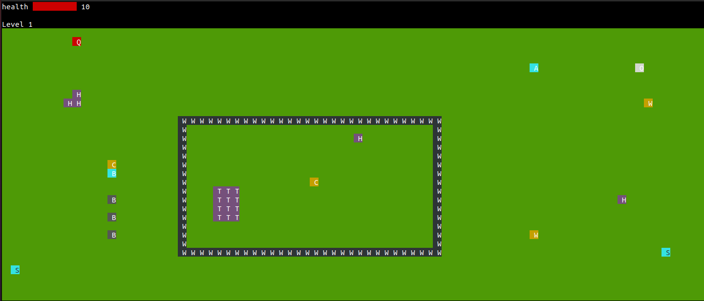

# Clash of Clans

This is the terminal based version of the popular game **Clash of Clans** built in python3 without using any curses library(like pygame) and using the concept of OOPS. The user gets to select bewteen using a king or a queen. The following are some important commands to know for playing this game :
+ `w` makes the king/queen move up
+ `a` makes the king/queen move left
+ `s` makes the king/queen move down
+ `d` makes the king/queen move down
+ `<space>` makes the king/queen attack. The king/queen destroys any building to its top/bottom/left/right
+ `z` spawns a barbarian in the bottom-left spawning point
+ `x` spawns a balloon in the bottom-left spawning point
+ `c` spawns an archer in the bottom-left spawning point
+ `u` spawns a barbarian in the top-right spawning point
+ `i` spawns a balloon in the top-right spawning point
+ `o` spawns an archer in the top-right spawning point
+ `m` spawns a barbarian in the bottom-right spawning point
+ `n` spawns a balloon in the bottom-right spawning point
+ `b` spawns an archer in the bottom-right spawning point
+ `e` activates Archer Queen's Eagle Arrow attack
+ `h` heal spell: increases king's and barbarians' health to 150% of the current health (capped at the maximum health)
+ `r` rage spell : doubles damage and movement speed of barbarians and king
+ `q` quits the game

## Buildings
### Static Buildings
1. Huts (H)
2. Townhall (T)
3. Walls

### Defensive Buildings
1. Cannons (C)
2. Wizard Towers (W)

## Troops
1. Barbarian (B)
   - assist the king in battle
   - target the nearest building, moving towards it and attack it.
2. Archer (A)
   - Archers can attack OVER walls and buildings.
   - Move similar to barbarians
   - Attack from a distance
3. Balloon (O)
   - aerial troop, i.e. walls and buildings do not affect its movement and certain defensive buildings can’t attack it.
   - Only wizard tower can attack it.

## Levels
There are 3 levels in the game with increasing levels of difficulty as you have to face more number of cannons and wizard towers!

**Note**: Replay is available for every game you play so that you can be better prepared in your next game! Just run `python3 replay.py` and enter the name of the file from replays folder for which you want to see the replay of the game.

**Win**: All buildings (excluding walls) have been destroyed

**Defeat**:All troops and the King have died without destroying all buildings

**Assumptions**
- Manhattan distance has been used to calculate the nearest bulding for the barbarian to attack and also the nearest troop for the cannon to attack
- Rage and heal spells can be used any number of times